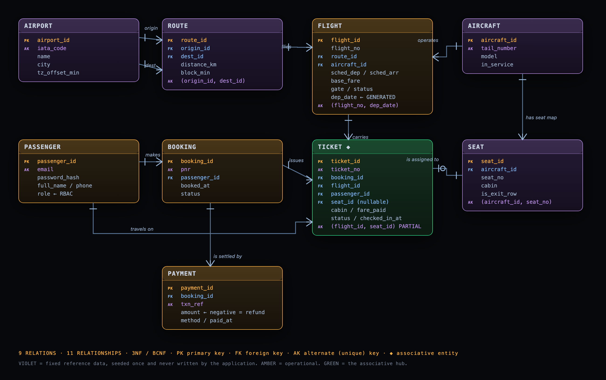

# SkyBase — Airline Reservation & Flight Operations

**DBMS Project-Based Learning · Project 18** · Flask + PostgreSQL

A working airline reservation system with a customer side and an operations
dashboard, built on a nine-relation schema normalised to 3NF. The point of the
project is the database, so the SQL is hand-written and on display: every
report page can show you the query that produced it, and `/admin/schema` reads
the constraints back out of the PostgreSQL catalog so what you see is what is
actually being enforced.

---

## The one thing worth demonstrating first

Open **`/admin/lab`** — the Concurrency Lab.

It fires two real transactions at the same seat from two threads and reports
what the database did to each. Run it twice:

| Mode | T1 | T2 | Result |
|---|---|---|---|
| `SELECT … FOR UPDATE` | blocks, re-reads, bails cleanly | commits | one holder |
| no lock | commits | rejected, SQLSTATE **23505** | one holder |

Two independent defences, both demonstrably sufficient:

```sql
-- 1 · pessimistic: the first transaction locks the row, the second waits
SELECT seat_id FROM seat WHERE seat_id = ANY(%s) ORDER BY seat_id FOR UPDATE;

-- 2 · declarative: the backstop, which holds even without the lock
CREATE UNIQUE INDEX uq_ticket_seat_per_flight
    ON ticket (flight_id, seat_id)
 WHERE seat_id IS NOT NULL;
```

The index is **partial**, which is the detail that makes it work: cancelling a
ticket sets `seat_id` to `NULL`, so the seat is freed for the next passenger
while two *live* tickets still cannot share it.

---

## Running it

Needs Python 3.11+ and a PostgreSQL 15+ you can connect to.

```bash
python3 -m venv .venv && source .venv/bin/activate
pip install -r requirements.txt

cp .env.example .env.local        # then set DATABASE_URL
python init_db.py                 # schema + seed + accounts + demo traffic
python app.py                     # http://127.0.0.1:5001
```

`init_db.py` prints the sign-in details when it finishes:

| Role | Email | Password |
|---|---|---|
| Admin | `ops@skybase.in` | `skybase-ops` |
| Customer | `asha@example.com` | `flyskybase` |

Demo bookings are created by calling the same `db.book_seats()` the website
calls, so the sample data is consistent with every constraint and trigger by
construction rather than by being hand-written to look plausible.

---

## The schema — nine relations



Reduced from the nineteen-relation Review 1 model on the reviewer's
instruction to keep the diagram small: **one carrier, three airports, six
routes, three airframes**, all of it fixed reference data the application never
writes.

| Relation | Rows | What it holds |
|---|---|---|
| `airport` | 3 | HYD, BOM, DEL — fixed |
| `route` | 6 | every directed pair of those three — fixed |
| `aircraft` | 3 | two A320neo, one ATR 72 — fixed |
| `seat` | 140 | the seat map, per airframe — fixed |
| `flight` | grows | one dated operation of a route; the only relation admins write |
| `passenger` | grows | login account **and** traveller, with a `role` column |
| `booking` | grows | one PNR, one payer |
| `ticket` ◆ | grows | **the associative hub** — booking × flight × passenger × seat |
| `payment` | grows | append-only ledger; a refund is a negative row |

### What was folded in, and why it is still 3NF

| Review 1 relation | Where it went | Why that is not a violation |
|---|---|---|
| `AIRCRAFT_TYPE` | `aircraft.model` | `tail_number → model`, and `tail_number` is a candidate key. Capacity is **not stored** — it is `COUNT(seat)` — so there is no `model → capacity` dependency to violate. |
| `CABIN_CLASS` | `cabin` domain column | Its only attribute was a fare multiplier, which is a business constant, not data about a cabin. |
| `FARE` | `flight.base_fare` + `ticket.fare_paid` | The price charged is frozen onto the ticket, so repricing a flight tomorrow cannot rewrite what was paid today. |
| `CHECK_IN` | `ticket.checked_in_at` | A 1:1 optional relation with one attribute does not earn a relation. |
| `CANCELLATION` | `ticket.status` + negative `payment` | Keeps the money trail append-only. |
| `BOOKING.total_amount` | derived | `SUM(ticket.fare_paid)`. Not stored, so it cannot disagree with its own tickets. |
| 4 RBAC relations | `passenger.role` | Two roles, not seven. |

**One rule is deliberately absent.** Review 1 listed
`UNIQUE(flight_id, passenger_id)`. Because `passenger` is both the account and
the traveller here, one account legitimately holds several seats on one flight
when somebody books for their family — that constraint would reject a valid
booking. The seat-per-flight index is untouched; the per-booking seat cap is an
application policy, which is where a policy limit belongs.

---

## What the database enforces

`/admin/schema` lists all of this live. In summary: **55 constraints, 3
triggers, 5 views** across 9 relations.

Three rules need triggers, each because it reads another row or relation and so
cannot be a `CHECK`:

| Trigger | Rule |
|---|---|
| `ticket_seat_matches_aircraft` | a seat must exist on the airframe operating that flight |
| `ticket_capacity` | live tickets ≤ `COUNT(seat)` — tested at exactly *N* and *N+1* |
| `ticket_flight_sellable` | no selling a ticket on a departed or cancelled flight |

Two `CHECK` constraints are worth pointing at, because they make two fields
incapable of disagreeing:

```sql
-- a cancelled ticket cannot keep a seat; a live one must have one
CHECK ((status =  'CANCELLED' AND seat_id IS     NULL)
    OR (status <> 'CANCELLED' AND seat_id IS NOT NULL))

-- status and timestamp move together or not at all
CHECK ((status =  'CHECKED_IN' AND checked_in_at IS NOT NULL)
    OR (status <> 'CHECKED_IN' AND checked_in_at IS     NULL))
```

And `flight.dep_date` is a **generated column** (`sched_dep::date`), so the
alternate key `UNIQUE(flight_no, dep_date)` is enforced on a value that cannot
drift out of step with the timestamp it comes from.

---

## Reports

Four views, each exercising a different construct. Every one is visible in the
UI with its SQL next to it.

| | Report | SQL it demonstrates |
|---|---|---|
| R-01 | Flight manifest | multi-table `INNER` + `LEFT JOIN` |
| R-02 | Occupancy & load factor | `COUNT`, `GROUP BY`, `FILTER`, computed ratio |
| R-03 | Route demand | outer joins + `GROUP BY`, so empty routes still appear |
| R-04 | Revenue | `FILTER`ed aggregates over a signed ledger |

---

## Access control

One `role` column on `passenger`, one `@admin_only` decorator, checked on every
admin route. Customers additionally cannot read another customer's PNR: the
booking view compares `passenger_id` against the session and returns 403.

| | Customer | Admin |
|---|---|---|
| Search, book, seat map | ✓ | ✓ |
| Own bookings, check-in, cancel | ✓ | ✓ |
| All bookings, manifests, reports | | ✓ |
| Create flights, set status | | ✓ |
| Concurrency lab, live schema | | ✓ |

---

## Layout

```
app.py              Flask routes — raw SQL, no ORM
db.py               connection + the booking / cancel / check-in transactions
init_db.py          one-command build: schema, seed, accounts, demo traffic
sql/schema.sql      DDL — the graded artifact: PK, FK, UNIQUE, CHECK, triggers, views
sql/seed.sql        the fixed reference data and the flight schedule
templates/          Jinja — customer pages and admin/
static/css/app.css  the design language, hand-written
static/js/app.js    five behaviours, no framework
docs/               Review 1 deliverables + the ER diagram
```

## Deployment

Render (web service) + Neon (Postgres). `render.yaml` is a blueprint; set
`DATABASE_URL` to the Neon **pooled** connection string in the dashboard, then
run `python init_db.py` once against it.

Because this repository is public, `init_db.py` **refuses to seed a remote
database** unless you set your own `ADMIN_PASSWORD` — otherwise the admin
dashboard of the deployed site would be open to anyone who read the source.

Seed a remote database with `--light`. Every demo booking goes through
`book_seats()` on its own connection, which is the point — the sample data is
consistent with every constraint by construction — but ~690 of them across a
region boundary takes ten minutes. `--light` seeds a fifth of that in about
two.

```bash
export DATABASE_URL='postgresql://...-pooler...neon.tech/neondb?sslmode=require'
export ADMIN_PASSWORD='something long'
python init_db.py --light
```

Point `DATABASE_URL` at Neon's **pooled** endpoint. The app disables psycopg's
automatic prepared statements because that endpoint is PgBouncer in
transaction mode, where a statement prepared on one backend connection may not
exist on the next.

Render's free tier sleeps after 15 minutes idle, so the first request after a
quiet spell takes ~40s. A free pinger (cron-job.org, every 10 min) keeps it
warm — worth setting up before a demo.

---

## Design

The visual language is called **Night Apron** — an airfield after dark. The
palette is lifted off real aerodrome lighting rather than invented: apron
floodlight amber for identity and actions, threshold green for available and
confirmed, beacon red for cancelled and refused, taxiway blue for information.
The departure board is a split-flap; the ticket is a boarding pass with a
perforated stub; small uppercase monospace is the airport-signage voice used
for anything a machine would print.
